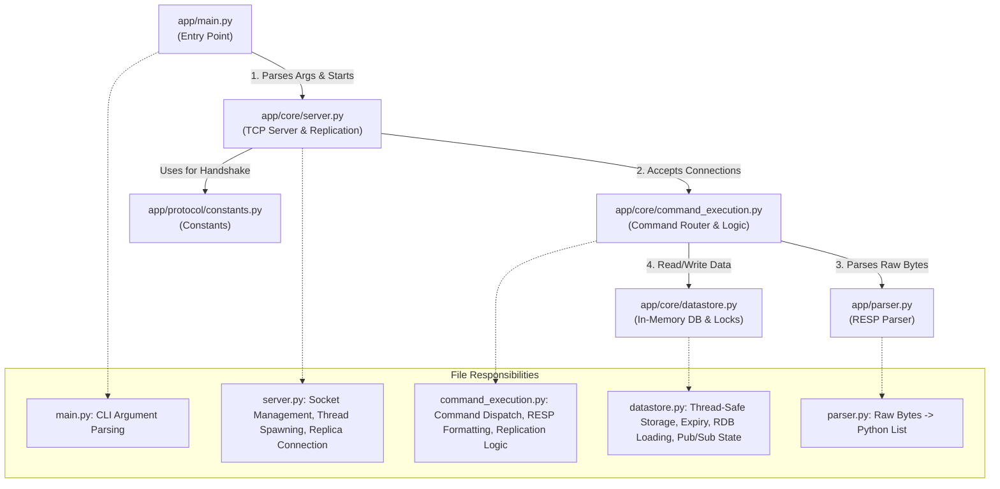

# Redix - Full-Featured Redis Implementation in Python

A comprehensive Redis-compatible server implementation in Python, designed to demonstrate advanced systems programming concepts including TCP networking, concurrency control, distributed replication, and protocol parsing.

> [!NOTE]
> This project is an **educational implementation** meant for portfolios and learning system design. It is **not** intended for production environments.

## Architecture

### High-Level Design

The system follows a multi-threaded architecture to handle concurrent client connections while maintaining data consistency through fine-grained locking.

```mermaid
graph TD
    Clients[Clients] -->|TCP Connection| Server[TCP Server]
    Server -->|Accept| ConnectionHandler[Connection Handler Thread]
    ConnectionHandler -->|Parse RESP| Parser[RESP Parser]
    Parser -->|Command| Executor[Command Executor]
    
    subgraph "Core Engine"
        Executor -->|Read/Write| DataStore[Data Store (Memory)]
        Executor -->|Pub/Sub| PubSub[Pub/Sub Manager]
        Executor -->|Streams| StreamEngine[Stream Engine]
    end
    
    subgraph "Replication"
        Master[Master Server] -.->|Propagate| Replica[Replica Server]
    end
```

### Data Storage & Concurrency

The core data storage is an in-memory dictionary protected by a global `DATA_LOCK` (mutex) to ensure thread safety during atomic operations.

#### Key Components

1.  **`DATA_STORE`**: The central dictionary holding all keys.
    *   **Structure**: `Dict[str, Entry]`
    *   **Entry**: `{'type': str, 'value': Any, 'expiry': Optional[int]}`
2.  **`DATA_LOCK`**: A `threading.Lock` that guards verified atomic operations (SET, GET, LPOP, etc.).
3.  **Side Structures**:
    *   `SORTED_SETS`: Specialized storage for ZSETs.
    *   `STREAMS`: Append-only logs for Stream data types.
    *   `BLOCKING_CLIENTS`: Queues for clients waiting on BLPOP/XREAD calls.

### Request Processing Flow

1.  **Connection**: Server accepts a socket connection.
2.  **Threading**: A new `threading.Thread` is spawned for the client.
3.  **Parsing**: The `RESP Parser` reads raw bytes and converts them into Python objects.
4.  **Execution**: `execute_single_command` dispatches the command to the appropriate handler.
5.  **Response**: The handler performs the operation (acquiring locks if needed) and returns a RESP-encoded byte string.

### Directory Structure

```
app/
├── main.py                      # Entry point
├── core/
│   ├── server.py                # TCP server and replication logic
│   ├── command_execution.py     # All command handlers
│   ├── context.py               # Server context and global state
│   └── datastore.py             # Complete data store implementation
├── protocol/
│   ├── resp.py                  # RESP protocol parser
└── tests/                       # Integration and unit tests
```

### Codebase Structure & Module Interaction

The following diagram illustrates how the Python files interact and their specific responsibilities:



---

## Features & Internals

This section explains *what* each feature is, *how* it works internally, and *how* to use it with `redis-cli`.

### 1. Redis Serialization Protocol (RESP)
*   **What it is**: The binary-safe protocol Redis uses to communicate.
*   **How it works**: The `RESP Parser` (`app/parser.py`) reads bytes from the TCP socket, identifying types by their first byte (`+` for strings, `$` for bulk strings, `*` for arrays). It recursively parses nested arrays.
*   **Usage**: Transparent to the user. All clients (redis-cli, libraries) speak this automatically.

### 2. Strings & Expiration
*   **What it is**: Basic key-value storage with Time-To-Live (TTL).
*   **How it works**: Values are stored in `DATA_STORE` wrapper dicts: `{'value': ..., 'expiry': timestamp}`. The `get_data_entry` function checks the timestamp on every access (lazy expiry) and deletes the key if expired.
*   **Usage**:
    ```bash
    SET mykey "Hello World" PX 5000  # Set with 5s expiry
    GET mykey                        # Returns "Hello World"
    ```

### 3. Master-Slave Replication
*   **What it is**: Distributed state where one Master handles writes and replicates them to Slaves.
*   **How it works**:
    1.  **Handshake**: Replica connects and sends `PSYNC`.
    2.  **Sync**: Master sends an empty RDB file (snapshot) to initialize.
    3.  **Propagation**: Master forwards all *write* commands (`SET`, `DEL`, etc.) to connected replicas via their TCP sockets.
    4.  **Offset Tracking**: Replicas track bytes received to handle `WAIT` commands for synchronous replication.
*   **Usage**:
    ```bash
    # Start Master
    python -m app.main --port 6379

    # Start Replica
    python -m app.main --port 6388 --replicaof localhost 6379
    ```

### 4. Streams
*   **What it is**: an append-only log data structure.
*   **How it works**: Stored in `STREAMS` as a list of entries. `XADD` validates IDs (must be incremental). `XREAD` supports blocking by using a `threading.Condition` variable to put the client thread to sleep until new data arrives.
*   **Usage**:
    ```bash
    XADD mystream * sensor-id 1234 temperature 19.8
    XRANGE mystream - +
    XREAD BLOCK 1000 STREAMS mystream 0
    ```

### 5. Pub/Sub
*   **What it is**: Real-time messaging where publishers send messages to channels and subscribers receive them.
*   **How it works**: 
    *   `CHANNEL_SUBSCRIBERS` maps channel names to a Set of client sockets.
    *   When `PUBLISH` is called, the server iterates through the socket list for that channel and writes the message directly to them.
*   **Usage**:
    ```bash
    # Client A
    SUBSCRIBE mychannel

    # Client B
    PUBLISH mychannel "Hello Subscribers!"
    ```

---

## Production Readiness Assessment

### ⚠️ Current Status: Educational / Portfolio Ready
This project is **Implementation Complete** for the core Redis feature set but is **Not Production Ready** for critical business data.

| Criteria | Status | Notes |
|----------|--------|-------|
| **Stability** | ✅ High |  Passes standard redis-py integration tests. |
| **Concurrency** | ⚠️ Medium | Uses threads (good for I/O), but limited by Python GIL for CPU tasks. |
| **Persistence** | ⚠️ Partial | Loads RDB files but does not currently implement background saving (BGSAVE). |
| **Security** | ❌ None | No password auth (AUTH) or TLS encryption implemented. |
| **Scalability** | ❌ Low | Single-threaded event loop (conceptually) via Python threads; not async/await based. |

### Recommended Deployment
For **Portfolio Demonstrations**, deploy as a Docker container on a free tier service (e.g., Render, Railway) to show it working live.

**Dockerfile**:
```dockerfile
FROM python:3.9-slim
WORKDIR /app
COPY . .
CMD ["python", "-m", "app.main", "--port", "6379"]
```

---

## Portfolio & Resume Positioning

When adding this project to your resume, focus on **Systems Engineering** and **Internal Architecture** rather than just "I built a clone".

### How to Describe It
> "Architected a multi-threaded, Redis-compatible distributed key-value store in Python. Implemented the RESP wire protocol, fine-grained locking for thread safety, and a Master-Slave replication mechanism capable of dynamic command propagation and offset tracking."

### Key Talking Points for Interviews
1.  **Concurrency Model**: Explain how you used `threading.Lock` to strictly serialize write operations while allowing concurrent client handling, effectively mimicking Redis's atomic guarantees.
2.  **Protocol Design**: Discuss parsing the RESP stream and handling TCP fragmentation (e.g., ensuring you don't read half a command).
3.  **Distributed Systems**: Highlight the Replication implementation—specifically how you handled the "Split Brain" problem (basically, how replicas know they are replicas) and the `WAIT` command implementation using `threading.Condition` to enforce synchronous write guarantees.
4.  **Data Structures**: Detail the underlying Python structures used to mimic Redis efficiency (e.g., using Dictionaries for O(1) hashing).

---

## Quick Start

### Prerequisites
*   Python 3.9+
*   `redis-cli` (optional, for testing)

### Running the Server
```bash
python -m app.main
```
*   Server runs on `localhost:6379` by default.

### Running Tests
```bash
pip install pytest redis
python -m pytest tests/
```
