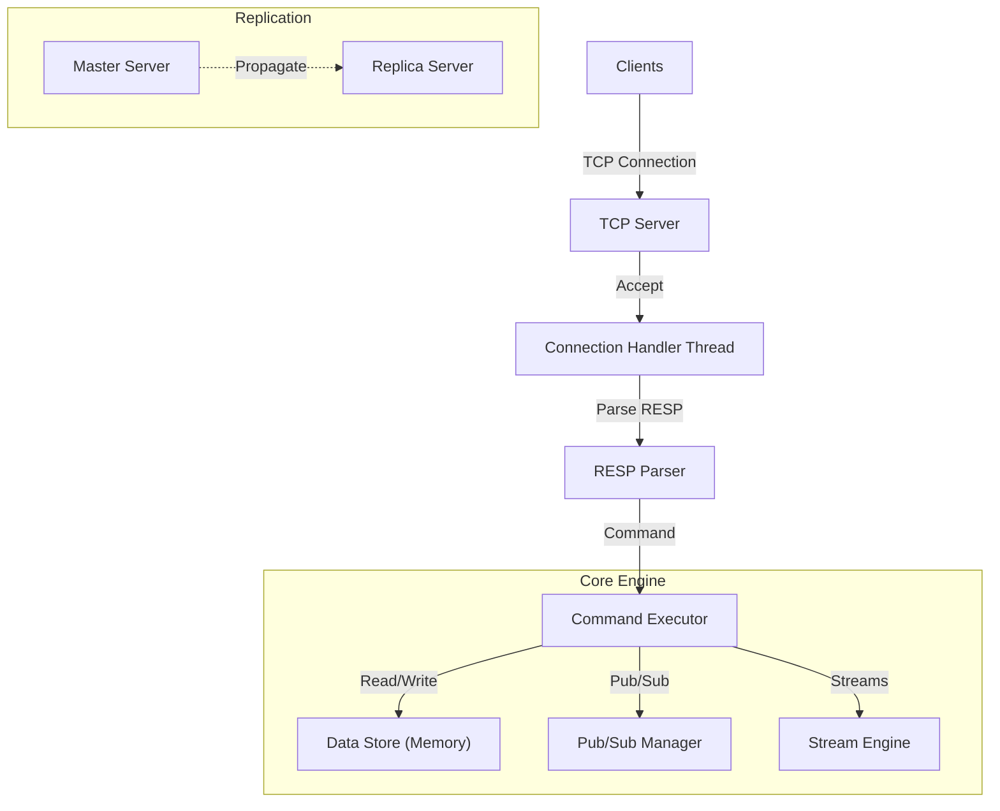
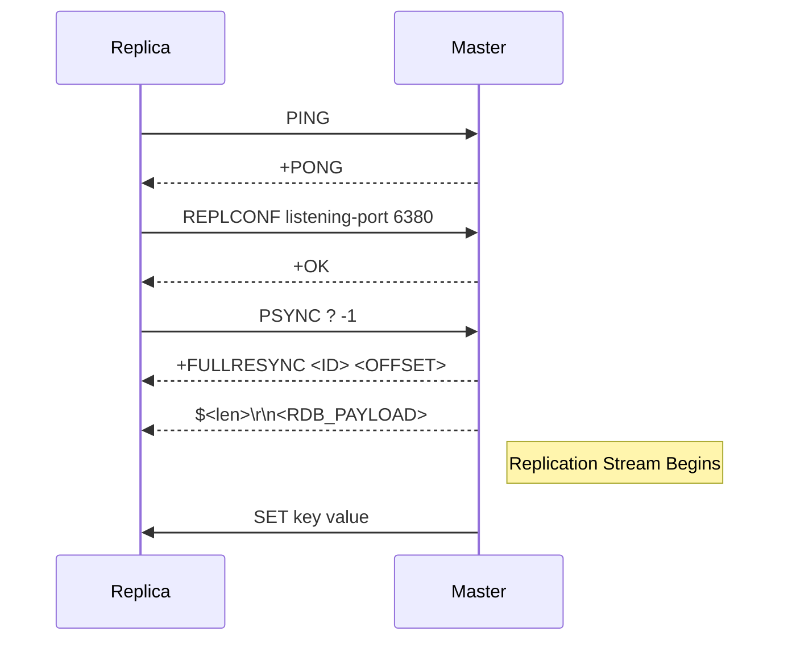

# System Architecture

## Overview

This project is a high-performance, thread-safe, distributed key-value store implementation in Python, designed to be compatible with the Redis Serialization Protocol (RESP). It supports complex data structures (Strings, Lists, Streams, Sorted Sets), Pub/Sub messaging, and Master-Slave replication.

## High-Level Architecture

The system follows a multi-threaded architecture to handle concurrent client connections while maintaining data consistency through fine-grained locking.

## Data Storage & Concurrency

The core data storage is an in-memory dictionary protected by a global `DATA_LOCK` (mutex) to ensure thread safety during atomic operations.

### Key Components

1.  **`DATA_STORE`**: The central dictionary holding all keys.
    *   **Structure**: `Dict[str, Entry]`
    *   **Entry**: `{'type': str, 'value': Any, 'expiry': Optional[int]}`
2.  **`DATA_LOCK`**: A `threading.Lock` that guards verified atomic operations (SET, GET, LPOP, etc.).
3.  **Side Structures**:
    *   `SORTED_SETS`: Specialized storage for ZSETs to allow O(log N) operations (conceptually, though implemented with dicts/sorts here).
    *   `STREAMS`: Append-only logs for Stream data types.
    *   `BLOCKING_CLIENTS`: Queues for clients waiting on BLPOP/XREAD calls.

## Request Processing Flow

1.  **Connection**: Server accepts a socket connection.
2.  **Threading**: A new `threading.Thread` is spawned for the client.
3.  **Parsing**: The `RESP Parser` reads raw bytes and converts them into Python objects (Lists of Byte Strings).
4.  **Execution**: `execute_single_command` dispatches the command to the appropriate handler.
5.  **Response**: The handler performs the operation (acquiring locks if needed) and returns a RESP-encoded byte string.

## Replication Mechanism

The system implements Master-Slave replication compatible with the Redis protocol.

### Handshake & Sync
1.  **Replica Connects**: Replica sends `PING`, `REPLCONF listening-port`, `REPLCONF capa psync2`.
2.  **PSYNC**: Replica sends `PSYNC ? -1` to request full synchronization.
3.  **Snapshot Transfer**: Master sends `+FULLRESYNC` followed by a binary RDB snapshot (empty template in this implementation).
4.  **Command Propagation**: Master continuously streams write commands (`SET`, `DEL`, etc.) to all connected replicas.

## Supported Features

| Category | Commands |
|----------|----------|
| **Key-Value** | `SET`, `GET`, `PING`, `ECHO`, `keys`, `type`, `config` |
| **Lists** | `LPUSH`, `RPUSH`, `LPOP`, `BLPOP` (Blocking), `LLEN`, `LRANGE` |
| **Streams** | `XADD`, `XRANGE`, `XREAD` (Blocking) |
| **Sorted Sets** | `ZADD`, `ZRANK`, `ZRANGE`, `ZCARD`, `ZSCORE`, `ZREM` |
| **Pub/Sub** | `SUBSCRIBE`, `UNSUBSCRIBE`, `PUBLISH` |
| **Transactions** | `MULTI`, `EXEC`, `DISCARD` (Basic queuing) |
